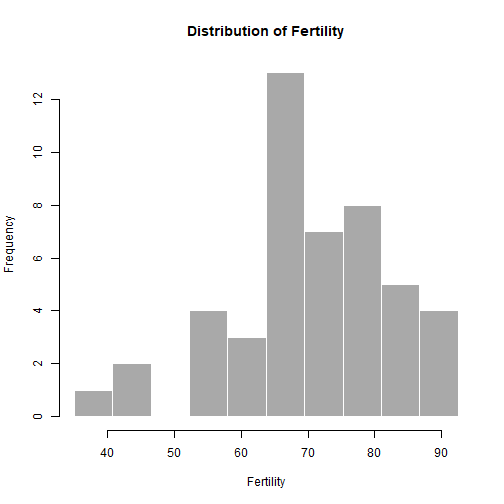

Swiss Indicators
========================================================
author: Konstantinos Maniotis
date: 21/11/2020
autosize: true

Introduction
========================================================

This is the reproducible pitch presentation for the final course project of Coursera Data Science Specialization Course 9: Developing Data Science Tools. This document will go over the basics of developing the Shiny app. For more information, please see the following links:

1. The Swiss Fertility and Socioeconomic Indicators Data (swiss data) can be accessed with **data(swiss)** in R
3. The GitHub repository containing the R codes required to build the Shiny App (**server.R** and **ui.R**)can be accessed [here](https://github.com/kostasman/Swiss-Fertility-and-Socioeconomic-Indicators-Data-Exploration)
2. The Shiny app can be accessed [here](https://kostasman.shinyapps.io/Swiss_Indicators/), which contains
  - Exploring the distribution of each variable in a histogram
  - Exploring the relationship of up to three variables in a scatter plot

The Swiss Data
========================================================


```r
data(swiss)
summary(swiss)
```

```
   Fertility      Agriculture     Examination      Education    
 Min.   :35.00   Min.   : 1.20   Min.   : 3.00   Min.   : 1.00  
 1st Qu.:64.70   1st Qu.:35.90   1st Qu.:12.00   1st Qu.: 6.00  
 Median :70.40   Median :54.10   Median :16.00   Median : 8.00  
 Mean   :70.14   Mean   :50.66   Mean   :16.49   Mean   :10.98  
 3rd Qu.:78.45   3rd Qu.:67.65   3rd Qu.:22.00   3rd Qu.:12.00  
 Max.   :92.50   Max.   :89.70   Max.   :37.00   Max.   :53.00  
    Catholic       Infant.Mortality
 Min.   :  2.150   Min.   :10.80   
 1st Qu.:  5.195   1st Qu.:18.15   
 Median : 15.140   Median :20.00   
 Mean   : 41.144   Mean   :19.94   
 3rd Qu.: 93.125   3rd Qu.:21.70   
 Max.   :100.000   Max.   :26.60   
```

Codes for Histogram
========================================================


```r
inputVar <- 'Fertility'; inputBin <- 10; histVal <- swiss[, inputVar]
hist(histVal, breaks = seq(min(histVal), max(histVal), length.out = inputBin+1),
     xlab = inputVar, main = paste('Distribution of', inputVar),
     col = 'darkgray', border = 'white')
```



Codes for Scatter Plot
========================================================


```r
library(ggplot2)
scatX <- 'Fertility'; scatY <- 'Education'; scatC <- 'Examination'
ggplot(data = swiss, aes(x = Fertility, y = Education, color = Examination)) + 
      geom_point() + xlab(scatX) + ylab(scatY) + labs(colour = scatC) +
      ggtitle(paste('Scatter plot of', scatX, 'vs', scatY)) +
      theme(plot.title = element_text(hjust = 0.5))
```


